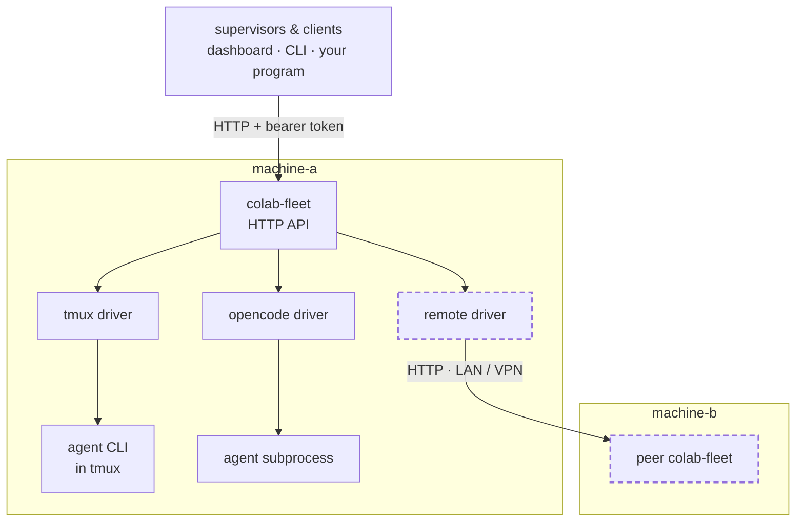
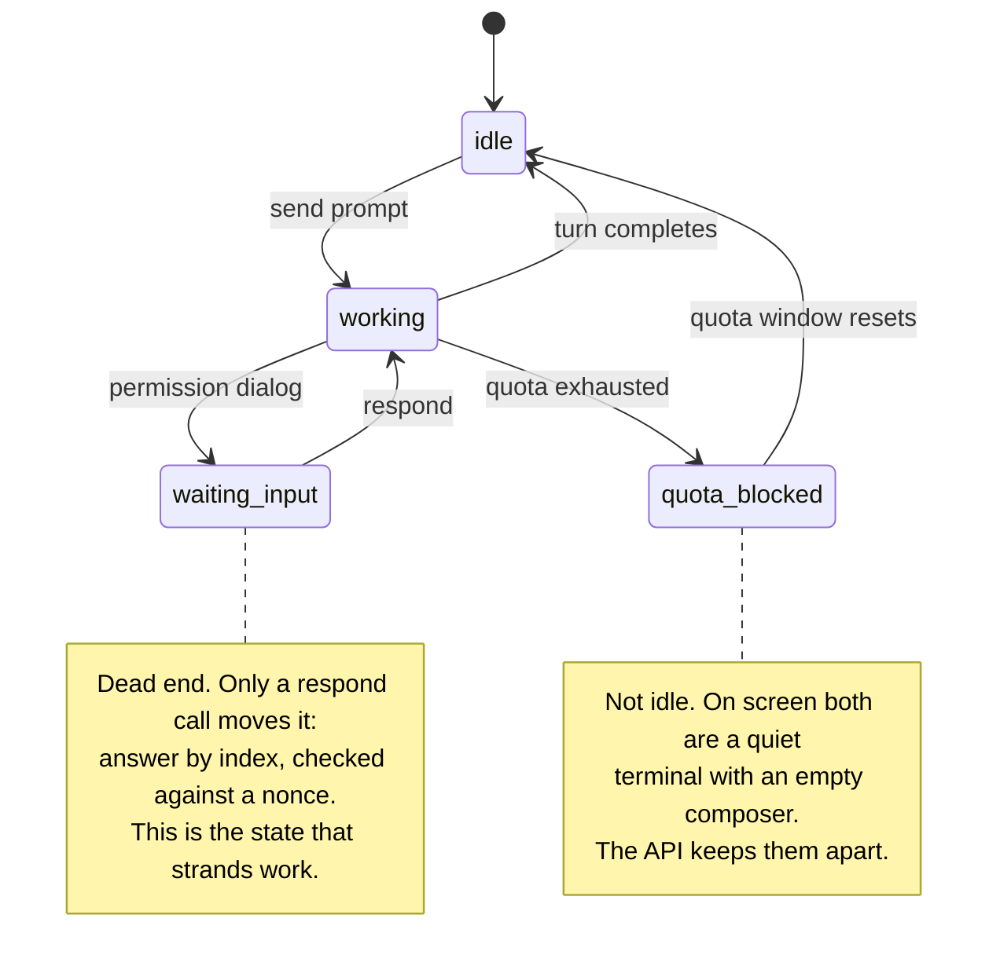
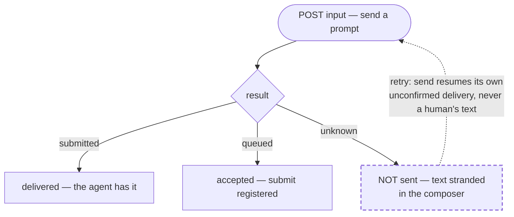
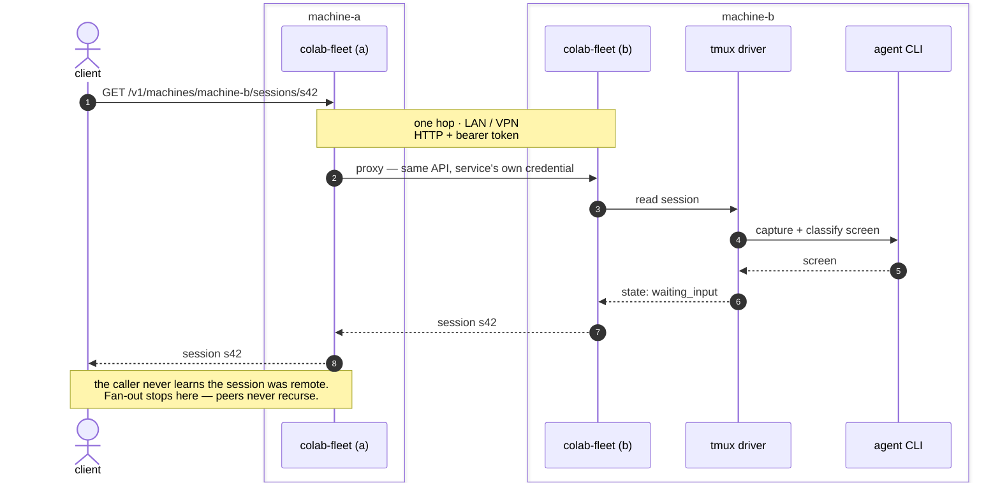

# colab-fleet

**One API for every coding-agent session you are running — on every machine you
are running them on.**

Go, standard library only, no dependencies. MIT.

You have coding agents running in terminals. Probably several. Possibly on more
than one machine. Right now the only way to know what any of them is doing is to
look at it, and the only way to answer one is to walk over to it.

`colab-fleet` is a machine-local service that **owns** those sessions and puts
them behind an HTTP API — list them, read what state each one is in, send one an
instruction, answer the permission dialog one is stuck on. Peer instances
federate, so a session on the machine in the other room is one call away and
looks exactly like a local one.



*A session driver is an interface. The remote peer is just another driver —
which is why federation cost nothing to add.*

---

## What problem this actually solves

A fleet of coding agents needs two separable things: something that decides
**what work should happen**, and something that knows **how a session is
actually run and where**. Most implementations fuse them — the supervisor shells
out to a terminal multiplexer, scrapes the screen to guess what the agent is
doing, and is thereby permanently bound to one runtime on one host.

`colab-fleet` is the second half, extracted. Supervisors become clients.

Three properties fall out of that one decision:

- **Runtime independence.** A driver is an interface, not a hardcoded
  subprocess. Three exist today: a terminal multiplexer driving an interactive
  agent CLI, a third-party agent spawned as a subprocess and spoken to over
  HTTP, and a peer service on another machine.
- **Machine-to-machine is free.** A remote peer is *just another driver*. There
  was no separate federation feature to build.
- **Churn is contained.** When a runtime changes underneath you, the damage
  lands on one driver instead of everywhere.

That last one matters more than it looks. The value of the abstraction does not
depend on any particular runtime being good; it is what makes betting on one
affordable.

## What it will never own

Version control state, worktrees, issue trackers, work claims, planning, or any
judgement about whether work is finished.

> **colab-fleet knows a session has a working directory.
> It does not know what a worktree is.**

A fleet layer that learns what an issue is has become a second supervisor, and
now two components believe they are in charge. Every field in this API is tested
against that sentence.

---

## The parts that are unusual

Most tools in this space manage sessions on one laptop, for one vendor's agent,
behind a TUI. The properties below are the ones that turned out to be rare, and
they are all consequences of taking failure seriously rather than features that
were designed for their own sake.

### A session has a state, not a pulse



On screen, an agent that finished, an agent out of quota, an agent whose turn
died on a transient error, and an agent holding text nobody submitted all look
identical: a quiet terminal with an empty composer. Collapsing them is how
abandoned work goes unnoticed for a day.

So they are different states, each carrying its evidence, and every state says
whether it was `observed` from a structured read or `inferred` from a screen.

### Sending a prompt is not fire-and-forget



`unknown` means the text is sitting in the composer and was **not** submitted. A
system that reports success here loses instructions silently, and you find out
hours later when nothing happened. Retrying resubmits only text the service
itself placed there — never text a human typed.

There is a fourth outcome, `refused`, for when the driver actively protects the
session from input that would corrupt it. A refusal is information to act on,
not a fault to retry, so it arrives as an ordinary `200`.

### A session blocked on a dialog can be answered remotely

The dialog is read with every option enumerated, and you answer by index —
carrying a nonce, so your answer cannot land on a question that changed while
you were deciding. A session lost to a question nobody can reach is the most
expensive failure in a fleet, and an ordinary `send` cannot fix it: the property
that makes `send` safe for messages makes it useless for control.

### Every route is authenticated, and exposure is never accidental

There is no unauthenticated mode — not on loopback, not in development. A
service with no token refuses to start. The default bind is loopback on an
ephemeral port, and binding all interfaces logs a warning that names the risk.
Callers are named principals with per-verb grants; every mutation is audited
with an actor, not an address.

---

## Quickstart

Go 1.26 or newer. No dependencies.

```sh
go build ./... && go test ./...
```

### One machine

```sh
export FLEET_MACHINE=machine-a
export FLEET_TOKEN="$(openssl rand -hex 32)"
export FLEET_ADDR=127.0.0.1:9000
go run ./cmd/colab-fleetd
```

```sh
curl -s -H "Authorization: Bearer $FLEET_TOKEN" http://127.0.0.1:9000/v1/health
```

There is no default port — pick one and keep it. The default bind is loopback on
an ephemeral port, so a service you have not deliberately configured is
reachable only from its own machine.

### Two machines, over a LAN or a VPN

Four steps. Do **machine-b first** — machine-a needs an address to point at.

**1. Give each machine its own credential.** Not one shared token: the whole
point of the next three steps is that the two machines have distinct identities.

```sh
mkdir -p ~/.config/colab-fleet
openssl rand -hex 32 > ~/.config/colab-fleet/machine-a.token
chmod 600 ~/.config/colab-fleet/machine-a.token
```

**2. On machine-b — the one that owns the sessions.** Bind the interface the
peer will actually reach: **a specific address, never `0.0.0.0`**. On a VPN that
is the VPN address; on a trusted LAN it is the LAN address. Loopback is added
alongside it automatically, so the service never becomes undiagnosable from its
own machine.

```sh
export FLEET_MACHINE=machine-b
export FLEET_TOKEN="$(cat ~/.config/colab-fleet/machine-b.token)"
export FLEET_ADDR=10.8.0.12:9000        # this machine's VPN or LAN address
export FLEET_ALLOW_MUTATIONS=1          # permit writes to its own sessions
colab-fleetd
```

**3. On machine-a — the one that will call it.** A peer is statically
configured; there is no discovery. The address is one **you** have confirmed
reachable from this machine, never the peer's own idea of its name — that is how
a fleet ends up pointing at a hostname which resolves on only one side.

```sh
export FLEET_MACHINE=machine-a
export FLEET_TOKEN="$(cat ~/.config/colab-fleet/machine-a.token)"
export FLEET_PEERS="machine-b=http://10.8.0.12:9000"
export FLEET_ALLOW_RELAY=1              # permit forwarding writes to a peer
colab-fleetd
```

**4. Verify, from machine-a.**

```sh
curl -s -H "Authorization: Bearer $(cat ~/.config/colab-fleet/machine-a.token)" \
  http://127.0.0.1:9000/v1/machines
```

```json
{ "items": [ { "machine": "machine-a", "self": true,  "status": "ok" },
             { "machine": "machine-b", "self": false, "status": "ok" } ],
  "complete": true }
```

Both reading `ok` is the entire handshake. If machine-b reads `unreachable`,
the bind address or the network path is wrong — **not** the token: a bad
credential is a `401`, not a silence.

> **The two credentials are not symmetric.** The token machine-a presents for a
> peer is *machine-a's identity on machine-b*, not machine-b's identity here.
> They are different secrets, and conflating them is how a fleet quietly ends up
> back on one shared token.

You now have one API over both machines. What to do with it is below.


## One machine drives another

What the two-machine setup above actually buys you, end to end. Every call is
made against the **local** service; that it crosses a LAN or a VPN to reach the
other machine is the service's problem, not the caller's.



### Drive it

```sh
FLEET=http://127.0.0.1:9000
AUTH="Authorization: Bearer $(cat ~/.config/colab-fleet/machine-a.token)"
```

**Every session on both machines, as one list:**

```sh
curl -s -H "$AUTH" "$FLEET/v1/sessions?scope=fleet"
```

```json
{
  "items": [
    { "machine": "machine-a", "id": "s17", "state": { "status": "working",       "confidence": "inferred" } },
    { "machine": "machine-b", "id": "s42", "state": { "status": "waiting_input", "confidence": "inferred",
        "waitingOn": "prompt",
        "prompt": { "question": "Allow running tests?", "options": ["No", "Yes", "Yes, always"],
                    "selected": 1, "kind": "tool-permission", "nonce": "a3f1" } } }
  ],
  "sources": [ { "machine": "machine-a", "status": "ok" }, { "machine": "machine-b", "status": "ok" } ],
  "complete": true
}
```

Read `complete` before you trust that list. If the VPN was down, `machine-b`
would report unreachable, `complete` would be `false`, and the response would
still be a `200` — because "the machine did not answer" and "the session does
not exist" are different facts and must never look the same.

**Send an instruction to a session on the other machine:**

```sh
curl -s -X POST -H "$AUTH" -H 'Content-Type: application/json' \
  -d '{"text":"run the test suite","submit":true}' \
  "$FLEET/v1/machines/machine-b/sessions/s42/input"
```

```json
{ "outcome": "submitted" }
```

If that comes back `"unknown"`, the text is stranded in the composer on the
other machine and was not sent. Retry the identical call with
`"resumeIfStranded": true`.

**Answer the dialog it is blocked on** — quoting the nonce from the read above:

```sh
curl -s -X POST -H "$AUTH" -H 'Content-Type: application/json' \
  -d '{"choice":2,"nonce":"a3f1"}' \
  "$FLEET/v1/machines/machine-b/sessions/s42/respond"
```

`choice` is 1-based against `prompt.options`, so this answers **"Yes"**. If the
prompt changed while you were deciding, the nonce no longer matches and the
answer is refused rather than applied to a different question.

### What has to be true for that to work

| | machine-a (calls) | machine-b (owns the session) |
|---|---|---|
| Reachable address | — | `FLEET_ADDR` on the LAN/VPN interface |
| Peer configured | `FLEET_PEERS` | — |
| Write to own sessions | — | `FLEET_ALLOW_MUTATIONS=1` |
| Forward writes to a peer | `FLEET_ALLOW_RELAY=1` | — |

With a principal table those two booleans become per-identity grants: the caller
needs `relay` on machine-a, and the verb grant (`send`) is checked on machine-b.
They are separate refusals and you meet them one at a time. Both default to
denied, on a fresh deployment as much as an established one.

> **Exposing this is a decision, not a default.** The service reads paths and,
> when mutations are enabled, starts processes. Put it on a VPN or a trusted
> LAN segment, bind a specific interface, and give each caller its own
> credential with only the grants it needs.

---

## Documentation

| If you want to | Read |
|---|---|
| Call the API | [`docs/api.md`](docs/api.md) — every endpoint at a glance |
| Write a client | [`docs/client-guide.md`](docs/client-guide.md) — a walkthrough, every example taken from a running service |
| Understand the design | [`docs/spec/session-abstraction.md`](docs/spec/session-abstraction.md) — the domain model. If you read one section, read §5.7 |
| Know the wire protocol exactly | [`docs/spec/api-http.md`](docs/spec/api-http.md) — normative |
| Adopt this in an existing system | [`docs/adoption.md`](docs/adoption.md) — staged so each step is reversible; §2 is the precondition that surprised us |
| Work on the service | [`docs/internals.md`](docs/internals.md) — measurements, decided questions, known gaps |
| Deploy it | [`docs/deploy.md`](docs/deploy.md) |
| Declare a machine-wide session identity | [`docs/session-identity.md`](docs/session-identity.md) — `sessionEnv`, precedence against a caller, verification |

The specs carry the reasoning; the code is a transcription of them, not the
other way round. The session spec is organised so you can tell current truth
from history: **§1–§13 are normative**, **§14 lists what the document requires
but cannot enforce** — read it before trusting any guarantee — and **Appendix A
is the findings log**, the measurements and bugs that produced the rules.

That appendix is kept rather than smoothed away on purpose. A reader who knows
only a rule will restate it; a reader who knows how it was violated will
recognise the next instance.

---

## Where this is going

Done, in order, each one having changed the specification rather than merely
implemented it:

- ✅ **A first working driver** — a terminal multiplexer running an interactive
  agent CLI. It amended four sections of the spec and found one defect the spec
  cannot fix on its own.
- ✅ **Event subscription** — over the substrate's own push channel, served as
  SSE with cursors, epoch, retention and announced resync. No polling anywhere.
- ✅ **A second driver: a remote peer** — federation, proven. A caller asks a
  service holding no local drivers, which proxies into a second service and
  back with real sessions in ~30 ms. Neither service needed a special case.
- ✅ **Answering, not just observing** — enumerated options, a nonce, and
  verification that the prompt actually cleared.
- ✅ **A second *local* driver** — a third-party agent spawned as a subprocess,
  the first able to declare `observesState: true`. Two runtimes on one machine
  at once, which is the proof the interface was worth having.
- ✅ **State that survives a restart** — idempotency keys, event epoch and
  cursor, and driver session records persisted atomically, so reconciliation
  can tell adopted from orphaned rather than calling everything orphaned.

Next, and this is where the value actually lands:

- ⬜ **A supervisor as a client**, replacing direct terminal-multiplexer access.
  Until that happens this is a second implementation of session management
  rather than a replacement for one. Planned in
  [`docs/adoption.md`](docs/adoption.md) — including the one precondition that
  cannot be discharged from inside this repository: nothing here prevents two
  machines editing one working tree, because repository state is a non-goal.
- ⬜ **Credential lifecycle.** Grants are per principal and per verb, and
  enrolment is a command. Nothing expires, a compromised token is revoked by
  editing a file, and changing a principal's grants means removing and
  re-adding it.
- ⬜ **Metrics.** Subprocess spawn cost is known to degrade with host load —
  8× on a machine under heavy load — and nothing measures it in production.

The honest list of what is missing is in
[`docs/internals.md`](docs/internals.md), kept current on purpose.

---

## License

[MIT](LICENSE). Copy it, run it, change it — the adoption path in
[`docs/adoption.md`](docs/adoption.md) exists for people who are not us, and a
documented adoption path with no licence grants them nothing.
